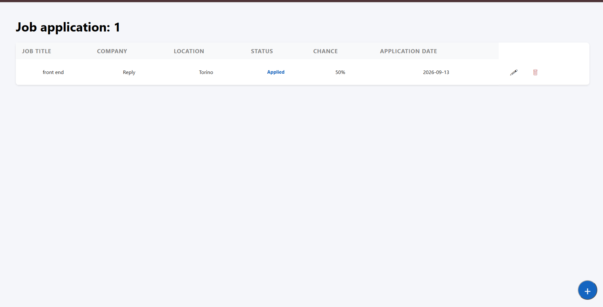
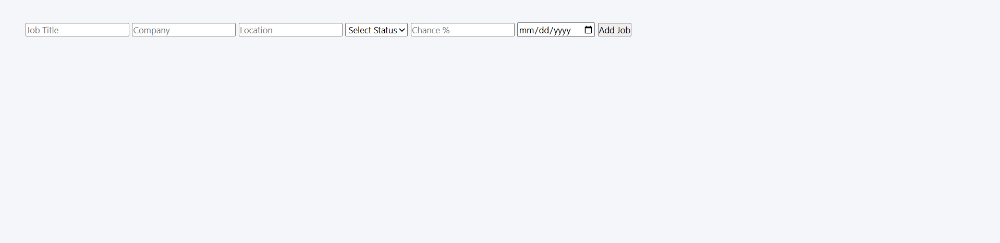
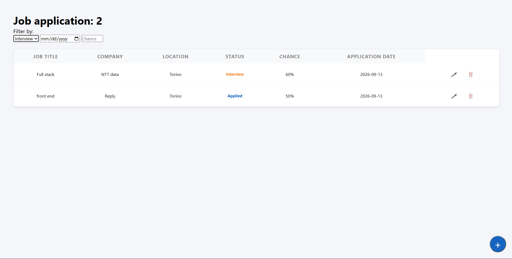
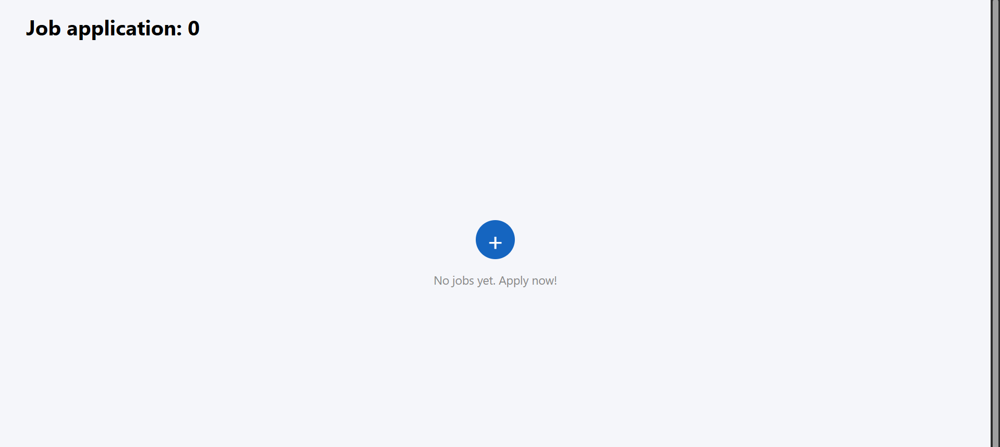

# Job Application Tracker

A simple web app to track job applications built with Node.js, Express, and EJS.

## Features
- Add, edit, delete job applications
- Filter by status, date, and chance
- Color-coded status badges

## Tech Stack
- Node.js
- Express
- EJS

## Run Locally
npm install
node app.js

## Screenshots

